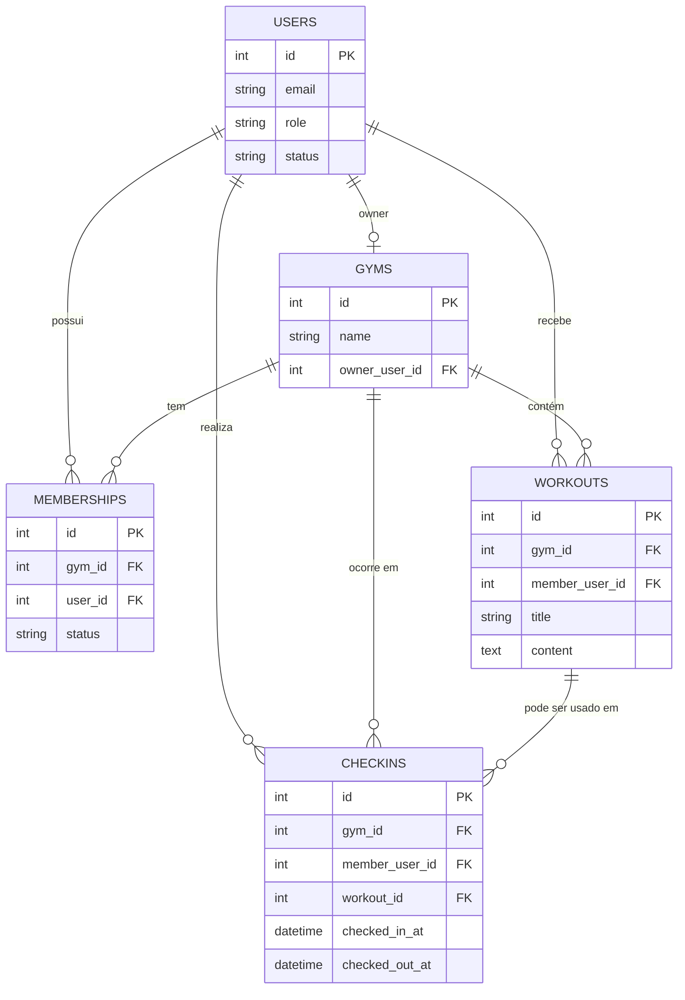

# Modelo Conceitual

Este modelo representa as entidades de negócio do sistema de academia e seus relacionamentos principais.

## Entidades e Regras

- **Usuário (`users`)**
  - Pode ser `owner` (dono) ou `member` (aluno).
  - Possui status (`active`/`pending`) e credenciais.
- **Academia (`gyms`)**
  - Cada academia possui exatamente um dono (`owner_user_id`).
- **Associação (`memberships`)**
  - Liga aluno a academia.
  - Controla status de aprovação do aluno na academia.
- **Treino (`workouts`)**
  - É cadastrado para um aluno específico dentro de uma academia.
- **Registro de treino / Check-in (`checkins`)**
  - Registra entrada e saída do aluno em um dia.
  - Pode referenciar o treino realizado (`workout_id`).

## Diagrama Conceitual (ER)

