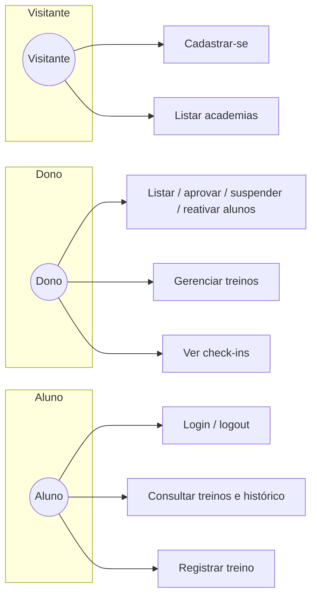

# Diagrama de Casos de Uso

Atores principais alinhados ao sistema atual (Academia Ge Ribeiro — portal estático + API PHP).

## Atores

| Ator | Descrição |
|------|-----------|
| **Visitante** | Usuário não autenticado (landing, lista de academias no cadastro se aplicável). |
| **Aluno** | Usuário `role = member` com vínculo à academia. |
| **Dono da academia** | Usuário `role = owner` da academia. |

---

## Catálogo de casos de uso

### Autenticação e cadastro

| ID | Caso de uso | Atores | Observação |
|----|-------------|--------|------------|
| UC-A01 | Registrar-se como aluno | Visitante | Cria usuário `pending` + vínculo `pending`. |
| UC-A02 | Autenticar-se (login) | Aluno, Dono | Sessão PHP / cookie. |
| UC-A03 | Encerrar sessão (logout) | Aluno, Dono | |
| UC-A04 | Consultar dados da sessão (`/auth/me`) | Aluno, Dono | |

### Dono da academia

| ID | Caso de uso | Observação |
|----|-------------|------------|
| UC-O01 | Listar alunos da academia | |
| UC-O02 | Aprovar cadastro de aluno | Somente vínculo `pending`. |
| UC-O03 | Suspender aluno (motivo genérico) | Vínculo → `suspended`; aluno em modo consulta. |
| UC-O04 | Reativar aluno suspenso | Vínculo → `active`. |
| UC-O05 | Gerenciar treinos por aluno | CRUD via API owner. |
| UC-O06 | Consultar check-ins | Lista filtrável por aluno. |

### Aluno

| ID | Caso de uso | Observação |
|----|-------------|------------|
| UC-M01 | Consultar treinos prescritos | Permitido ativo ou suspenso. |
| UC-M02 | Consultar histórico de registros | Idem. |
| UC-M03 | Registrar treino do dia (entrada/saída) | Somente vínculo **ativo** (não suspenso). |
| UC-M04 | Check-in / check-out simples | Endpoints legados; mesma regra de vínculo ativo. |

---

## Diagrama (visão geral)

**Nota:** Em ferramentas acadêmicas (Astah, StarUML, Draw.io) costuma-se desenhar o diagrama de caso de uso **oclusão + associação** entre atores e elipses; este arquivo documenta os casos e um diagrama Mermaid compacto para versionamento no Git.
