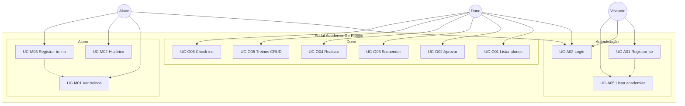

# Diagrama de Casos de Uso

Atores e casos de uso alinhados ao sistema atual (Portal Academia Ge Ribeiro — front estático + API PHP).

**Diagrama UML (exportável):** [`casos-de-uso.puml`](casos-de-uso.puml)

---

## Atores

| Ator | Descrição |
|------|-----------|
| **Visitante** | Usuário não autenticado (landing, cadastro, lista de academias). |
| **Aluno** | Usuário `role = member` com vínculo à academia. |
| **Dono da academia** | Usuário `role = owner` da academia. |

---

## Catálogo de casos de uso

### Autenticação e cadastro

| ID | Caso de uso | Atores | Observação |
|----|-------------|--------|------------|
| UC-A01 | Registrar-se como aluno | Visitante | Cria usuário `pending` + vínculo `pending`. Inclui escolha da academia (UC-A05). |
| UC-A02 | Autenticar-se (login) | Visitante, Aluno, Dono | Sessão PHP / cookie. |
| UC-A03 | Encerrar sessão (logout) | Aluno, Dono | |
| UC-A04 | Consultar dados da sessão (`/auth/me`) | Aluno, Dono | |
| UC-A05 | Listar academias (cadastro) | Visitante | `GET /api/gyms` no formulário de registro. |

### Dono da academia

| ID | Caso de uso | Observação |
|----|-------------|------------|
| UC-O01 | Listar alunos da academia | |
| UC-O02 | Aprovar cadastro de aluno | Somente vínculo `pending`. Usa `sp_approve_member`. |
| UC-O03 | Suspender aluno | Vínculo → `suspended`; aluno em modo consulta. |
| UC-O04 | Reativar aluno suspenso | Vínculo → `active`. |
| UC-O05 | Gerenciar treinos por aluno | CRUD via API owner. |
| UC-O06 | Consultar check-ins | Lista filtrável por aluno. |

### Aluno

| ID | Caso de uso | Observação |
|----|-------------|------------|
| UC-M01 | Consultar treinos prescritos | Permitido ativo ou suspenso. |
| UC-M02 | Consultar histórico de registros | Idem. |
| UC-M03 | Registrar treino do dia (entrada/saída) | Somente vínculo **ativo**. Data = hoje (Brasília). |

---

## Diagrama (visão geral — Mermaid)

Para entrega acadêmica com notação UML completa (elipses, sistema, `<<include>>`), use o arquivo PlantUML.

---

## Como exportar para PDF/PNG

1. Abra [`casos-de-uso.puml`](casos-de-uso.puml) em [PlantUML Online](https://www.plantuml.com/plantuml/uml).
2. Exporte PNG ou SVG para o relatório.
3. Alternativa: extensão **PlantUML** no VS Code / Cursor → preview → export.
