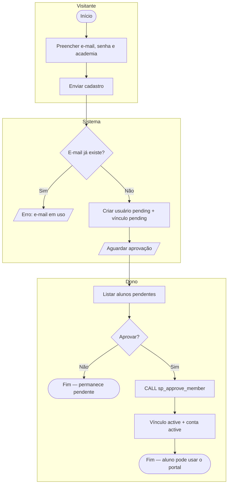
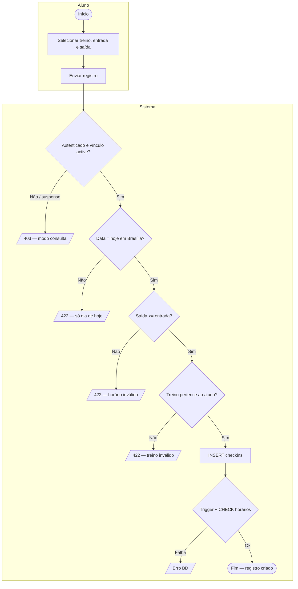
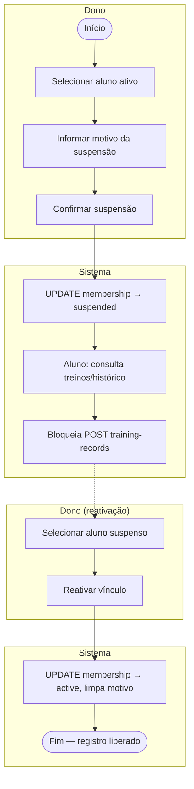
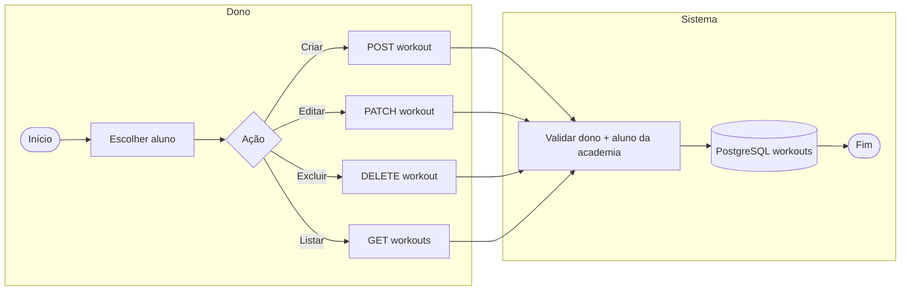

# Diagramas BPMN (processos de negócio)

Processos principais do **Portal Academia Ge Ribeiro**, alinhados ao fluxo real (front + API PHP + PostgreSQL).

> **Como exportar:** abra os arquivos `.puml` desta pasta em [PlantUML Online](https://www.plantuml.com/plantuml/uml), VS Code (extensão PlantUML) ou Astah/Draw.io (importar ou redesenhar a partir deste modelo).

---

## Índice de processos

| ID | Processo | Arquivo PlantUML |
|----|----------|------------------|
| BP-01 | Cadastro e aprovação de aluno | `bpmn-cadastro-aprovacao.puml` |
| BP-02 | Registro de treino do dia (aluno) | `bpmn-registro-treino.puml` |
| BP-03 | Suspensão e reativação de vínculo | `bpmn-suspensao-reativacao.puml` |
| BP-04 | Gestão de treinos pelo dono | `bpmn-gestao-treinos.puml` |

---

## BP-01 — Cadastro e aprovação de aluno

**Atores / pools:** Visitante (cadastro), Dono (aprovação), Sistema (API + BD).

---

## BP-02 — Registro de treino do dia

**Pré-condição:** aluno com vínculo **active** (não suspenso).

---

## BP-03 — Suspensão e reativação

---

## BP-04 — Gestão de treinos (dono)

---

## Legenda (notação simplificada)

| Símbolo | Significado BPMN |
|---------|------------------|
| `([ ])` | Evento início/fim |
| `[ ]` | Atividade/tarefa |
| `{ }` | Gateway (decisão) |
| `[/ /]` | Evento de mensagem/erro |
| `[( )]` | Armazenamento de dados |

Os arquivos `.puml` na mesma pasta usam **swimlanes** (partições) para aproximar a notação BPMN 2.0 com pools por ator.
