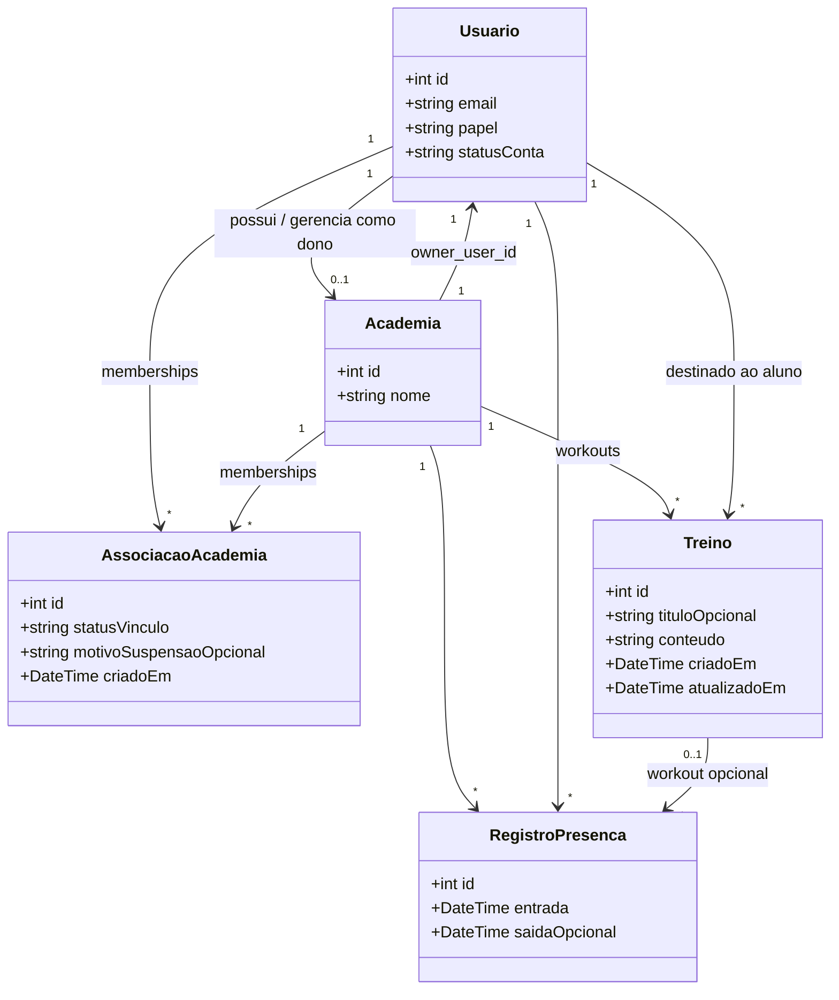

# Diagrama de Classes (domínio)

Visão **orientada a objetos do negócio** (entidades persistentes e relacionamentos). Não lista todas as classes PHP da camada de aplicação (`Controller`, `Router`, etc.) — apenas o **modelo de domínio** espelhado no banco + papéis.

---

## Diagrama UML (domínio)

---

## Papéis (`Usuario.papel`)

| Valor | Significado |
|-------|-------------|
| `owner` | Dono da academia (um registro em `gyms` ligado a este usuário). |
| `member` | Aluno. |

---

## Estados do vínculo (`AssociacaoAcademia.statusVinculo`)

| Valor | Significado |
|-------|-------------|
| `pending` | Aguardando aprovação do dono. |
| `active` | Aprovado; uso completo conforme regras da API. |
| `suspended` | Modo consulta no portal do aluno; sem registrar novos treinos até reativação. |

---

## Camada de aplicação (referência rápida)

Classes PHP principais (não no diagrama acima): `Router`, `AuthController`, `OwnerController`, `MemberController`, `Auth`, `Database`, `Request`, `Response`, `MembershipSuspension`.
