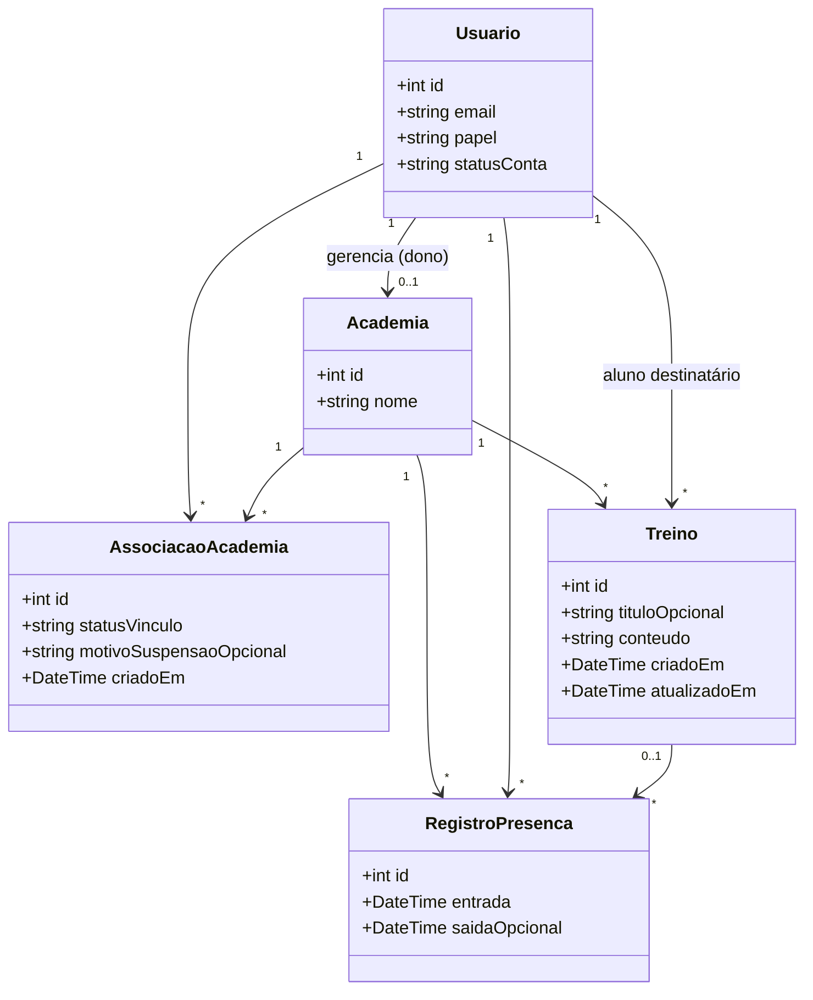

# Diagrama de Classes

Dois níveis de visão, alinhados ao projeto:

1. **Domínio** — entidades persistentes (espelho do PostgreSQL).
2. **Aplicação** — classes PHP da API (`api/src`).

**Diagramas UML (exportáveis):** [`diagrama-classes.puml`](diagrama-classes.puml) (contém os dois diagramas).

---

## 1. Domínio (negócio / banco)

### Mapeamento tabela ↔ classe

| Classe | Tabela PostgreSQL |
|--------|-------------------|
| `Usuario` | `users` |
| `Academia` | `gyms` |
| `AssociacaoAcademia` | `memberships` |
| `Treino` | `workouts` |
| `RegistroPresenca` | `checkins` |

---

## 2. Aplicação (API PHP)

Classes principais fora do domínio persistente:

| Classe | Responsabilidade |
|--------|------------------|
| `Router` | Despacho de rotas HTTP |
| `AuthController` | Login, logout, registro, `/me` |
| `OwnerController` | Gestão de alunos, treinos, check-ins |
| `MemberController` | Treinos, registro do dia, histórico |
| `Auth` | Regras de sessão e permissão |
| `BusinessTimezone` | Fuso `America/Sao_Paulo` |
| `MembershipSuspension` | Motivos de suspensão |
| `Database`, `Request`, `Response` | Infraestrutura HTTP/BD |

O segundo diagrama em `diagrama-classes.puml` mostra dependências entre essas classes.

---

## Papéis (`Usuario.papel`)

| Valor | Significado |
|-------|-------------|
| `owner` | Dono da academia (um registro em `gyms` ligado a este usuário). |
| `member` | Aluno. |

---

## Estados do vínculo (`AssociacaoAcademia.statusVinculo`)

| Valor | Significado |
|-------|-------------|
| `pending` | Aguardando aprovação do dono. |
| `active` | Aprovado; uso completo conforme regras da API. |
| `suspended` | Modo consulta no portal; sem registrar novos treinos. |

---

## Como exportar

Abra [`diagrama-classes.puml`](diagrama-classes.puml) no PlantUML — o arquivo gera **dois** diagramas (domínio e aplicação) em sequência.
