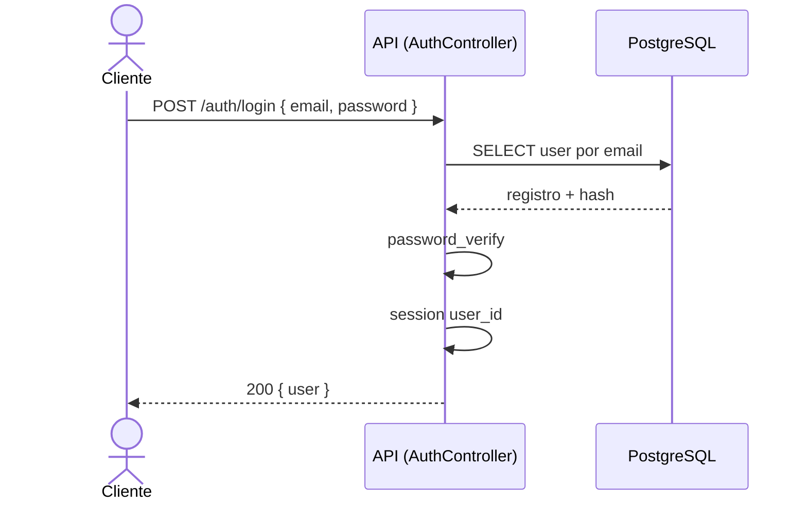
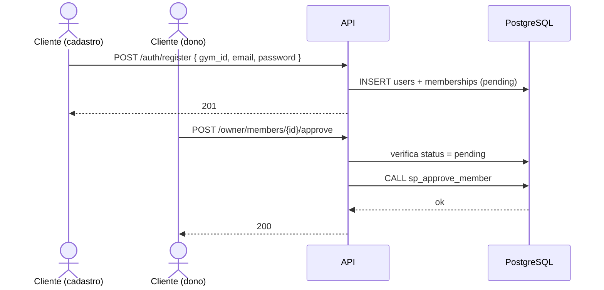
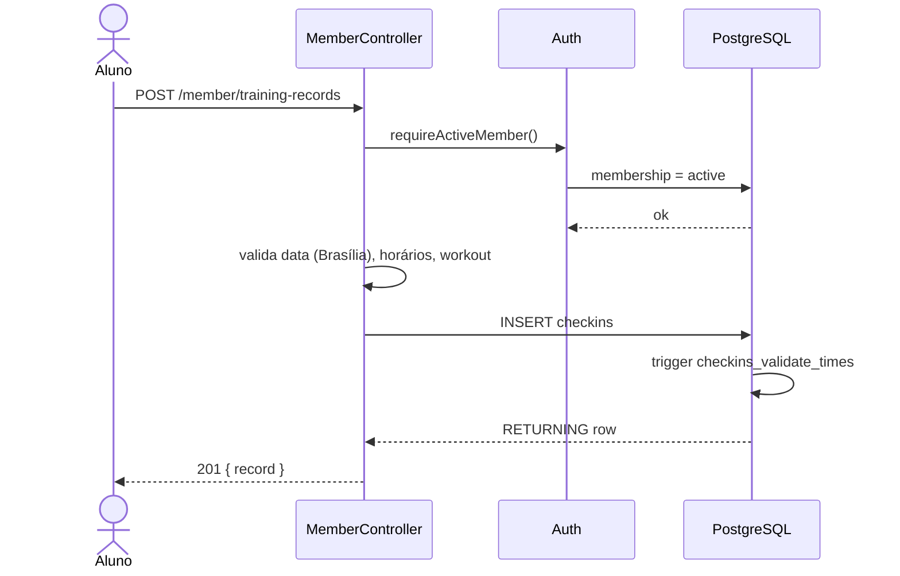
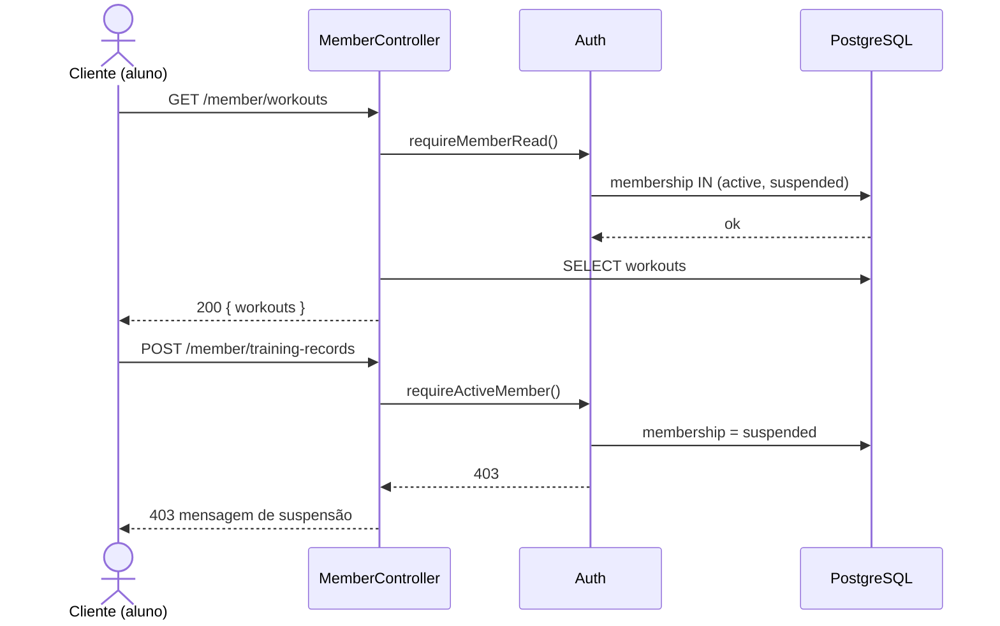

# Diagramas de Sequência

Fluxos principais da API (sessão PHP, JSON). Participantes: **Cliente** (navegador), **API** (PHP), **BD** (PostgreSQL).

**Diagramas UML (exportáveis):** [`diagrama-sequencia.puml`](diagrama-sequencia.puml) — quatro fluxos em um arquivo.

---

## 1. Login e sessão

---

## 2. Cadastro de aluno + aprovação pelo dono

---

## 3. Registro de treino do dia

---

## 4. Aluno suspenso: leitura vs escrita

---

## Como exportar

Cada bloco `@startuml` em [`diagrama-sequencia.puml`](diagrama-sequencia.puml) pode ser exportado separadamente como PNG/SVG para o relatório acadêmico.
