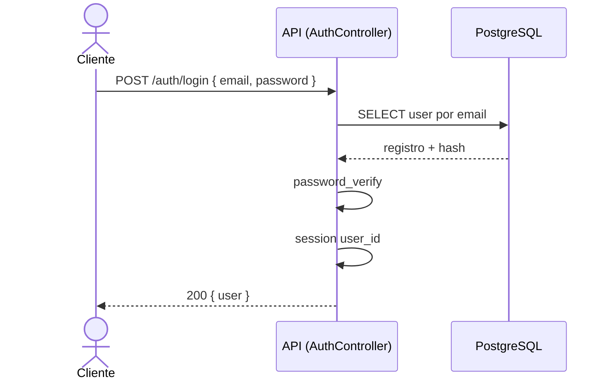
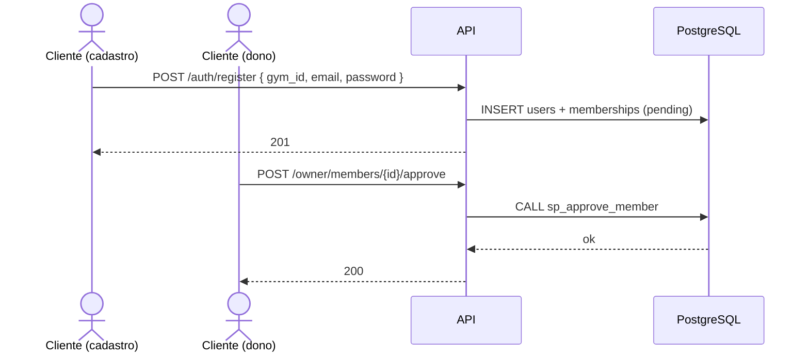
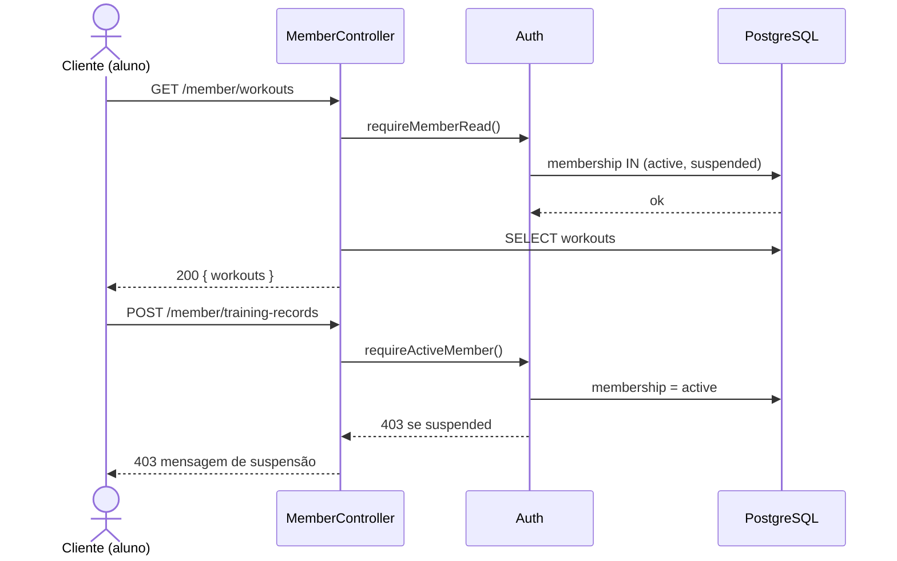

# Diagramas de Sequência

Fluxos principais da API (sessão PHP, JSON). Participantes genéricos: **Cliente** (navegador), **API** (PHP), **BD** (PostgreSQL).

---

## 1. Login e sessão



---

## 2. Cadastro de aluno + aprovação pelo dono



---

## 3. Suspender aluno (modo consulta)

```mermaid
sequenceDiagram
  actor Dono as Cliente (dono)
  participant API as OwnerController
  participant BD as PostgreSQL

  Dono->>API: POST /owner/members/{id}/suspend { reason }
  API->>BD: SELECT membership status = active
  API->>BD: UPDATE memberships SET suspended + suspension_reason
  API-->>Dono: 200

  Note over Dono,BD: Aluno permanece com conta active; só o vínculo muda para suspended.
```

---

## 4. Aluno suspenso: leitura vs escrita



---

**Observação:** Para relatório acadêmico, os mesmos fluxos podem ser redesenhados em ferramenta UML com lifelines nomeadas `Router`, `OwnerController`, etc.; aqui o foco é o comportamento observável do sistema.
